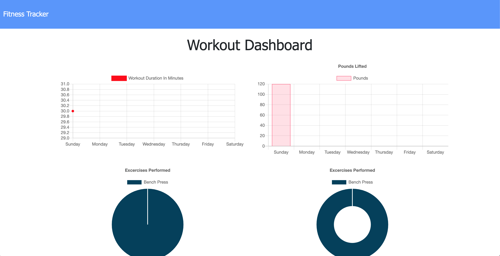

# exercise-tracker

<a href="https://exercise-workouts-tracker.herokuapp.com/?id=6031dff32aa4ad0015231f4f">Click here to see it in action.</a>

## Table of Contents

- [Description](#description)
- [Installation](#installation)
- [Usage](#usage)
- [License](#license)
- [Contributions](#contributions)
- [Tests](#tests)
- [Questions](#questions)

## Installation

_Steps required to install project and get the development environment established:_

- Simply use the npm install command in your terminal to install all necessary packages to launch our plant based application!

## Usage

_Instructions and examples for use:_

- On the home page you will be presented with 3 items.

1. Latest Workout
   1. This will be presented on your screen displaying your latest workout.
2. New Workout
   1. You can click on this section to go to make a new workout for to put down, you may choose to complete this workout or add this new exercise.
3. Continue Workout
   1. If you click you must out in an exercise to then be completed.
4. Dashboard
   1. This is where you can visually see all the exercises and workouts you have entered and performed through graphs and other statistics.

## License

- Built under the MIT licence.

## Credits

- Built & designed by Tomara Petty, Markos Escalante, Lili Cohen and Kat Nguyen.

## Test

- No tests required.

## Questions?

 

#### If you have any questions or want to make a contribution please reach out to me here:

 

**GitHub:**

- @lilipcohen  

**Email:**

- lili.cohen.tv@gmail.com  

**LinkedIn:**

- Lili: http://www.linkedin.com/in/lili-cohen-78a93a1b3
